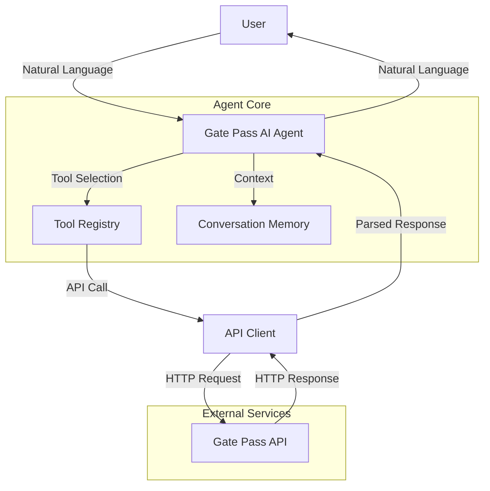

# Design Document: Gate Pass AI Agent

## Overview

The Gate Pass AI Agent is a conversational AI system that provides a natural language interface to the Gate Pass Management API. The agent translates user requests expressed in natural language into appropriate API calls, handles responses, and maintains conversation context across interactions.

The system is designed as a tool-based agent using the LangChain framework, where each API endpoint is exposed as a tool that the language model can invoke. The agent supports three distinct user roles (HR, Admin, Gate) with role-specific tool access, ensuring proper authorization and security.

### Key Design Principles

1. **Tool-Based Architecture**: Each API operation is encapsulated as a discrete tool with clear input/output specifications
2. **Role-Based Access Control**: Tools are filtered based on user role to enforce API permissions at the agent level
3. **Conversational Context**: The agent maintains state across turns to enable natural multi-turn conversations
4. **Error Resilience**: Comprehensive error handling translates API errors into user-friendly messages
5. **Type Safety**: Strong typing for tool parameters and API responses to prevent runtime errors

## Architecture

### System Components



### Component Responsibilities

**Gate Pass AI Agent (Main Orchestrator)**
- Receives natural language input from users
- Maintains conversation state and context
- Selects appropriate tools based on user intent
- Formats API responses into natural language
- Handles errors and provides user guidance

**Tool Registry**
- Stores tool definitions for all API operations
- Filters available tools based on user role
- Provides tool metadata to the language model
- Validates tool parameters before execution

**API Client**
- Manages HTTP communication with Gate Pass API
- Handles authentication and request formatting
- Parses API responses into structured data
- Implements retry logic and error handling
- Manages multipart form data for file uploads

**Conversation Memory**
- Stores conversation history
- Maintains context variables (e.g., current pass_number)
- Enables reference resolution across turns
- Persists for the duration of a user session

### Data Flow

1. User provides natural language input
2. Agent processes input with conversation context
3. Language model identifies intent and selects tool
4. Tool registry validates tool access for user role
5. API client executes HTTP request to Gate Pass API
6. API response is parsed and validated
7. Agent formats response into natural language
8. Response is returned to user
9. Conversation context is updated

## Components and Interfaces

### Tool Definitions

Each tool follows the LangChain tool specification format with the following structure:

```python
class ToolDefinition:
    name: str                    # Unique tool identifier
    description: str             # Natural language description for LLM
    parameters: Dict[str, Any]   # JSON Schema for parameters
    required_role: str           # Role required to access this tool
    api_endpoint: str            # API endpoint to call
    http_method: str             # HTTP method (GET, POST)
    response_handler: Callable   # Function to format API response
```

### HR Tools

**create_gate_pass**
- Description: "Create a new gate pass for a person. Requires person name, description of purpose, and whether the person will return."
- Parameters:
  - person_name (string, required): Name of the person
  - description (string, required): Purpose of the gate pass
  - is_returnable (boolean, required): Whether the person will return
- API: POST /hr/gatepass/create
- Role: HR_User

**list_gate_passes**
- Description: "List all gate passes with optional status filtering. Status can be 'pending', 'approved', 'rejected', 'exited', or 'returned'."
- Parameters:
  - status (string, optional): Filter by gate pass status
- API: GET /hr/gatepass/list
- Role: HR_User

**get_gate_pass_details**
- Description: "Get detailed information about a specific gate pass using its ID."
- Parameters:
  - pass_id (string, required): The gate pass ID
- API: GET /hr/gatepass/{pass_id}
- Role: HR_User

**print_gate_pass**
- Description: "Generate a printable version of a gate pass using its pass number (format: GP-YYYY-NNNN)."
- Parameters:
  - pass_number (string, required): The gate pass number
- API: GET /hr/gatepass/{pass_number}/print
- Role: HR_User

### Admin Tools

**list_pending_gate_passes**
- Description: "List all gate passes that are pending approval."
- Parameters: None
- API: GET /admin/gatepass/pending
- Role: Admin_User

**get_gate_pass_by_number**
- Description: "Get detailed information about a gate pass using its pass number."
- Parameters:
  - pass_number (string, required): The gate pass number
- API: GET /admin/gatepass/{pass_number}
- Role: Admin_User

**approve_gate_pass**
- Description: "Approve a pending gate pass. Requires the pass number and admin name."
- Parameters:
  - pass_number (string, required): The gate pass number
  - name (string, required): Name of the approving admin
- API: POST /admin/gatepass/{pass_number}/approve
- Role: Admin_User

**reject_gate_pass**
- Description: "Reject a pending gate pass. Requires the pass number and admin name."
- Parameters:
  - pass_number (string, required): The gate pass number
  - name (string, required): Name of the rejecting admin
- API: POST /admin/gatepass/{pass_number}/reject
- Role: Admin_User

**delete_gate_pass**
- Description: "Delete a gate pass. Requires the pass number and admin name."
- Parameters:
  - pass_number (string, required): The gate pass number
  - name (string, required): Name of the admin performing deletion
- API: POST /admin/gatepass/{pass_number}/delete
- Role: Admin_User

**list_all_gate_passes_admin**
- Description: "List all gate passes with optional status filtering."
- Parameters:
  - status (string, optional): Filter by gate pass status
- API: GET /admin/gatepass/list
- Role: Admin_User

**print_gate_pass_admin**
- Description: "Generate a printable version of a gate pass."
- Parameters:
  - pass_number (string, required): The gate pass number
- API: GET /admin/gatepass/{pass_number}/print
- Role: Admin_User

### Gate Tools

**scan_exit**
- Description: "Record a person's exit from the facility. Requires the gate pass number and a photo of the person."
- Parameters:
  - pass_number (string, required): The gate pass number
  - photo (file, required): Photo of the person exiting
- API: POST /gate/scan-exit
- Role: Gate_User

**scan_return**
- Description: "Record a person's return to the facility. Requires the gate pass number and a photo of the person."
- Parameters:
  - pass_number (string, required): The gate pass number
  - photo (file, required): Photo of the person returning
- API: POST /gate/scan-return
- Role: Gate_User

**get_gate_pass_by_number_gate**
- Description: "Get gate pass details using the pass number."
- Parameters:
  - pass_number (string, required): The gate pass number
- API: GET /gate/gatepass/number/{pass_number}
- Role: Gate_User

**get_gate_pass_by_id_gate**
- Description: "Get gate pass details using the pass ID."
- Parameters:
  - pass_id (string, required): The gate pass ID
- API: GET /gate/gatepass/id/{pass_id}
- Role: Gate_User

**get_gate_pass_photos**
- Description: "Retrieve photos associated with a gate pass."
- Parameters:
  - pass_number (string, required): The gate pass number
- API: GET /gate/photos/{pass_number}
- Role: Gate_User

### Notification Tools

**get_admin_notifications**
- Description: "Retrieve notifications for admin users."
- Parameters: None
- API: GET /notifications/admin
- Role: Admin_User

**get_hr_notifications**
- Description: "Retrieve notifications for HR users."
- Parameters: None
- API: GET /notifications/hr
- Role: HR_User

**mark_notification_read**
- Description: "Mark a notification as read."
- Parameters:
  - notification_id (string, required): The notification ID
- API: GET /notifications/mark-read/{notification_id}
- Role: Admin_User, HR_User

### QR Code Tools

**get_qr_code**
- Description: "Generate a QR code for a gate pass."
- Parameters:
  - pass_number (string, required): The gate pass number
- API: GET /qr/{pass_number}
- Role: All roles

### API Client Interface

```python
class GatePassAPIClient:
    def __init__(self, base_url: str, timeout: int = 30):
        """Initialize API client with base URL and timeout."""
        
    def request(
        self,
        method: str,
        endpoint: str,
        params: Optional[Dict] = None,
        json_data: Optional[Dict] = None,
        files: Optional[Dict] = None
    ) -> APIResponse:
        """Execute HTTP request with error handling and retries."""
        
    def handle_error(self, status_code: int, response_body: Dict) -> str:
        """Convert API error responses to user-friendly messages."""
```

### Agent Interface

```python
class GatePassAgent:
    def __init__(
        self,
        api_base_url: str,
        llm: BaseLLM,
        user_role: str
    ):
        """Initialize agent with API client, language model, and user role."""
        
    def chat(self, user_input: str) -> str:
        """Process user input and return natural language response."""
        
    def reset_context(self):
        """Clear conversation context for new session."""
```

## Data Models

### Gate Pass Object

```python
class GatePass:
    id: str                          # Unique identifier
    pass_number: str                 # Format: GP-YYYY-NNNN
    person_name: str                 # Name of the person
    description: str                 # Purpose of the pass
    is_returnable: bool              # Whether person will return
    status: str                      # pending, approved, rejected, exited, returned
    created_at: datetime             # Creation timestamp
    approved_at: Optional[datetime]  # Approval timestamp
    approved_by: Optional[str]       # Name of approver
    exit_time: Optional[datetime]    # Exit timestamp
    return_time: Optional[datetime]  # Return timestamp
    qr_code_url: Optional[str]       # URL to QR code image
```

### Notification Object

```python
class Notification:
    id: str                    # Unique identifier
    message: str               # Notification message
    type: str                  # Notification type
    created_at: datetime       # Creation timestamp
    is_read: bool              # Read status
    related_pass_id: Optional[str]  # Associated gate pass ID
```

### API Response

```python
class APIResponse:
    success: bool              # Whether request succeeded
    status_code: int           # HTTP status code
    data: Optional[Any]        # Response data
    error: Optional[str]       # Error message if failed
```

### Conversation Context

```python
class ConversationContext:
    current_pass_number: Optional[str]  # Currently referenced pass
    current_pass_id: Optional[str]      # Currently referenced pass ID
    last_operation: Optional[str]       # Last performed operation
    pending_parameters: Dict[str, Any]  # Parameters being collected
```

## Correctness Properties

*A property is a characteristic or behavior that should hold true across all valid executions of a system—essentially, a formal statement about what the system should do. Properties serve as the bridge between human-readable specifications and machine-verifiable correctness guarantees.*

Before defining the correctness properties, I need to analyze the acceptance criteria to determine which are testable as properties.


### Property Reflection

After analyzing all acceptance criteria, I've identified the following patterns:

**Tool Definition Examples (1.1-1.4, 2.1-2.7, 3.1-3.5, 4.1-4.3, 5.1, 12.1-12.6)**: These criteria all verify that tools exist with correct schemas. Rather than testing each tool individually, we can combine these into a single comprehensive property that validates all tool definitions against a schema.

**API Endpoint Mapping Properties (1.5-1.8, 2.8-2.11, 3.6-3.9, 4.4-4.6, 5.2)**: These criteria all verify that tool invocations result in correct API calls. These can be combined into a single property that validates the tool-to-API mapping for all tools.

**Role-Based Access Properties (8.4-8.6)**: These three criteria all verify role-based tool filtering. They can be combined into a single property that validates tool filtering for all roles.

**File Upload Properties (9.3-9.4)**: Property 9.4 is redundant with 3.6 and 3.7, which already verify that files are included in multipart form data.

**Redundant Properties**: 
- 9.4 is subsumed by 3.6 and 3.7 (file inclusion in multipart requests)
- Multiple tool definition examples can be consolidated into comprehensive validation

**Properties to Keep**:
- Comprehensive tool schema validation (consolidates 1.1-1.4, 2.1-2.7, 3.1-3.5, 4.1-4.3, 5.1, 12.1-12.3)
- Tool-to-API endpoint mapping (consolidates 1.5-1.8, 2.8-2.11, 3.6-3.9, 4.4-4.6, 5.2)
- Role-based tool filtering (consolidates 8.4-8.6)
- Role context persistence (8.1)
- Role-based authorization (8.2)
- QR code data return (5.3)
- File format validation (9.3)
- File size validation (9.5)
- Conversation context persistence (10.3)

### Property 1: Tool Schema Validation

*For any* tool in the tool registry, the tool definition must include a name, description, parameter schema with types, required role, API endpoint, and HTTP method.

**Validates: Requirements 1.1, 1.2, 1.3, 1.4, 2.1, 2.2, 2.3, 2.4, 2.5, 2.6, 2.7, 3.1, 3.2, 3.3, 3.4, 3.5, 4.1, 4.2, 4.3, 5.1, 12.1, 12.2, 12.3**

### Property 2: Tool-to-API Endpoint Mapping

*For any* tool invocation with valid parameters, the API client must make an HTTP request to the correct endpoint with the correct method and parameters as specified in the tool definition.

**Validates: Requirements 1.5, 1.6, 1.7, 1.8, 2.8, 2.9, 2.10, 2.11, 3.6, 3.7, 3.8, 3.9, 4.4, 4.5, 4.6, 5.2**

### Property 3: Role-Based Tool Filtering

*For any* user role (HR_User, Admin_User, Gate_User), the tool registry must only expose tools that are authorized for that role, where HR tools are only available to HR_User, Admin tools are only available to Admin_User, Gate tools are only available to Gate_User, and shared tools (QR code, notifications) are available to their respective authorized roles.

**Validates: Requirements 8.4, 8.5, 8.6**

### Property 4: Role Context Persistence

*For any* user session, if a role is set at session initialization, that role must remain accessible throughout the session until explicitly changed or the session ends.

**Validates: Requirements 8.1**

### Property 5: Role-Based Authorization Enforcement

*For any* tool execution attempt, if the user's role does not match the tool's required role, the tool execution must be blocked before any API call is made.

**Validates: Requirements 8.2**

### Property 6: QR Code Data Return

*For any* successful QR code API response containing image data, the agent must return that image data to the user without modification.

**Validates: Requirements 5.3**

### Property 7: File Format Validation

*For any* file provided for scan operations, if the file format is JPEG, PNG, or HEIC, the file must be accepted; if the format is not one of these, the file must be rejected with an appropriate error message.

**Validates: Requirements 9.3**

### Property 8: File Size Validation

*For any* file provided for scan operations, if the file size exceeds the configured maximum size limit, the file must be rejected with an error message indicating the size limit.

**Validates: Requirements 9.5**

### Property 9: Conversation Context Persistence

*For any* conversation context data stored during a user session, that data must remain accessible for the duration of the session and must be cleared when the session ends or is explicitly reset.

**Validates: Requirements 10.3**

### Property 10: Multipart Form Data File Inclusion

*For any* scan operation (exit or return) with a valid photo file and pass_number, the HTTP request must include both the pass_number and photo file in multipart form data format.

**Validates: Requirements 3.6, 3.7, 9.4**

## Error Handling

### Error Categories

**API Errors**
- 400 Bad Request: Invalid request format or parameters
- 403 Forbidden: Operation not permitted for current gate pass state
- 404 Not Found: Gate pass or resource does not exist
- 422 Unprocessable Entity: Validation errors on input data
- 500 Internal Server Error: Server-side error

**Network Errors**
- Connection timeout: API server unreachable
- Connection refused: API server not running
- DNS resolution failure: Invalid API base URL

**Client Errors**
- Invalid file format: Photo file not in JPEG, PNG, or HEIC format
- File too large: Photo file exceeds size limit
- Missing required parameter: Tool invoked without required parameter
- Invalid role: User role not recognized

### Error Handling Strategy

**API Error Handling**
1. Parse HTTP status code and response body
2. Extract error message and validation details if available
3. Map error to user-friendly category
4. Provide context-specific guidance for resolution
5. Log error details for debugging

**Network Error Handling**
1. Detect network failure type (timeout, connection refused, etc.)
2. Implement exponential backoff retry for transient failures
3. Maximum 3 retry attempts with 2s, 4s, 8s delays
4. After max retries, inform user and suggest manual retry
5. Log network errors with timestamps

**Client Error Handling**
1. Validate inputs before API calls
2. Check file format and size before upload
3. Verify required parameters are present
4. Validate role permissions before tool execution
5. Provide immediate feedback on validation failures

**Error Response Format**

All errors are returned to the user through the language model, which formats them into natural language. The agent provides structured error information to the LLM:

```python
class ErrorInfo:
    error_type: str          # Category of error
    error_message: str       # Technical error message
    user_guidance: str       # Suggested action for user
    retry_possible: bool     # Whether retry might succeed
    related_context: Dict    # Additional context (e.g., which parameter failed)
```

### Error Recovery Patterns

**Validation Errors (422)**
- Identify which parameter failed validation
- Explain the validation rule that was violated
- Suggest correct format or value range
- Allow user to retry with corrected input

**Not Found Errors (404)**
- Confirm the resource identifier (pass_number or pass_id)
- Suggest checking the identifier for typos
- Offer to list available gate passes
- Provide search functionality if applicable

**Forbidden Errors (403)**
- Explain the current state of the gate pass
- Describe which states allow the requested operation
- Suggest alternative operations that are permitted
- Provide status information about the gate pass

**Network Errors**
- Inform user of connectivity issue
- Indicate automatic retry in progress
- After max retries, suggest checking network connection
- Provide option to retry manually

## Testing Strategy

### Dual Testing Approach

The Gate Pass AI Agent will be tested using both unit tests and property-based tests to ensure comprehensive coverage:

**Unit Tests** focus on:
- Specific examples of tool definitions and their schemas
- Integration between agent components (tool registry, API client, memory)
- Edge cases like empty responses, malformed data, and boundary conditions
- Error handling for specific error codes and scenarios
- Configuration loading and environment-specific settings

**Property-Based Tests** focus on:
- Universal properties that hold across all inputs
- Tool schema validation for all tools in the registry
- API endpoint mapping correctness for all tool invocations
- Role-based access control for all role/tool combinations
- File validation for various file formats and sizes
- Context persistence across session lifecycles

### Property-Based Testing Configuration

**Framework**: We will use Hypothesis for Python, which is the standard property-based testing library for Python projects.

**Test Configuration**:
- Minimum 100 iterations per property test (due to randomization)
- Each property test references its design document property
- Tag format: `# Feature: gatepass-ai-agent, Property {number}: {property_text}`

**Example Property Test Structure**:

```python
from hypothesis import given, strategies as st
import pytest

# Feature: gatepass-ai-agent, Property 1: Tool Schema Validation
@given(tool_name=st.sampled_from(get_all_tool_names()))
@pytest.mark.property_test
def test_tool_schema_validation(tool_name):
    """For any tool in the tool registry, the tool definition must include
    required fields: name, description, parameter schema, required role,
    API endpoint, and HTTP method."""
    tool = tool_registry.get_tool(tool_name)
    
    assert tool.name is not None and len(tool.name) > 0
    assert tool.description is not None and len(tool.description) > 0
    assert tool.parameters is not None
    assert tool.required_role in ['HR_User', 'Admin_User', 'Gate_User', 'All']
    assert tool.api_endpoint is not None and tool.api_endpoint.startswith('/')
    assert tool.http_method in ['GET', 'POST']
```

### Unit Test Coverage

**Tool Registry Tests**:
- Test tool registration and retrieval
- Test role-based tool filtering
- Test tool schema validation
- Test handling of duplicate tool names

**API Client Tests**:
- Test successful API requests for each endpoint
- Test error handling for each HTTP status code
- Test retry logic with exponential backoff
- Test multipart form data formatting
- Test request timeout handling

**Agent Tests**:
- Test agent initialization with different roles
- Test conversation context management
- Test session lifecycle (start, use, reset, end)
- Test integration with mocked LLM
- Test integration with mocked API client

**File Handling Tests**:
- Test file format validation (JPEG, PNG, HEIC, invalid formats)
- Test file size validation (under limit, at limit, over limit)
- Test multipart form data construction with files

**Configuration Tests**:
- Test loading configuration from file
- Test environment-specific configuration
- Test missing configuration handling
- Test invalid configuration values

### Integration Testing

**End-to-End Scenarios**:
- HR user creates a gate pass through natural language
- Admin user approves a pending gate pass
- Gate user scans exit with photo upload
- User retrieves QR code for a gate pass
- User checks notifications and marks them as read

**Role-Based Access Testing**:
- Verify HR user cannot access Admin tools
- Verify Admin user cannot access Gate tools
- Verify Gate user cannot access HR tools
- Verify all users can access QR code tool

**Error Scenario Testing**:
- Test handling of 404 errors (non-existent gate pass)
- Test handling of 403 errors (invalid state transition)
- Test handling of 422 errors (validation failures)
- Test handling of network timeouts
- Test handling of invalid file uploads

### Test Data Generation

**Hypothesis Strategies**:
- `pass_number`: Strings matching format GP-YYYY-NNNN
- `person_name`: Non-empty strings with reasonable length
- `description`: Non-empty strings
- `status`: Sampled from valid status values
- `role`: Sampled from valid role values
- `file_format`: Sampled from valid and invalid image formats
- `file_size`: Integers ranging from 0 to 2x max size limit

### Mocking Strategy

**API Mocking**:
- Use `responses` library to mock HTTP requests
- Create fixtures for common API responses
- Simulate various error conditions
- Test retry behavior with transient failures

**LLM Mocking**:
- Mock LangChain LLM with deterministic responses
- Test tool selection logic independently
- Verify correct parameters are passed to tools
- Test response formatting with known outputs

### Continuous Integration

**Test Execution**:
- Run all unit tests on every commit
- Run property tests with 100 iterations in CI
- Run integration tests on pull requests
- Generate coverage reports (target: >80% coverage)

**Test Organization**:
- `tests/unit/` - Unit tests for individual components
- `tests/property/` - Property-based tests
- `tests/integration/` - End-to-end integration tests
- `tests/fixtures/` - Shared test data and mocks

